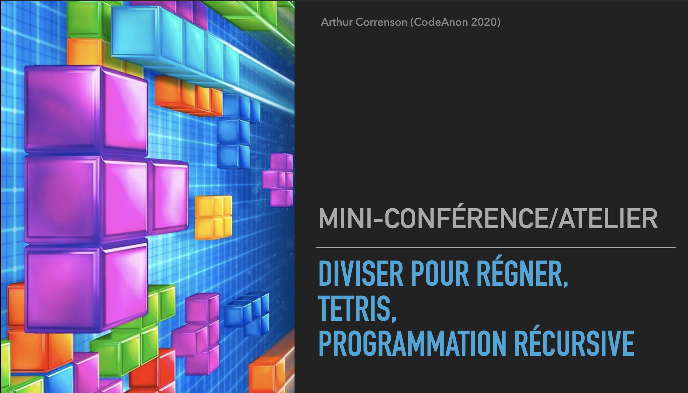

# Conférence 1 : Divisier pour régner, Tetris et programmation récursive

Dans cette conférence, nous avons parlé d'un problème de pavage. Nous proposons une implémentation en **OCaml** d'un algorithme pour résoudre ce problème.

## Le problème

+ On se donne une grille de taille `2^k`
+ On se donne une case (i, j) dans la grille
+ L'idée est de remplir toute la grille SAUF en (i, j) avec des pièces en L de taille 3.

## L'algorithme

Une solution pour résoudre ce problème est d'écrire une fonction récursive et de diviser le problème en 4 jusqu'à tomber sur une sous grille de côté 2. Il suffit de placer une unique pièce en L dans cette sous grille (à rotation près).

## Le code

Le code pour la résolution de l'algorithme se trouve dans le fichier `puzzle.ml`.
Il peut être executé sur tout système UNIX en tapant la commande `ocaml puzzle.ml`

## Les slides

Les slides de la présentation se trouve dans le fichier `conf1.pdf`

## Questions, retours ?

